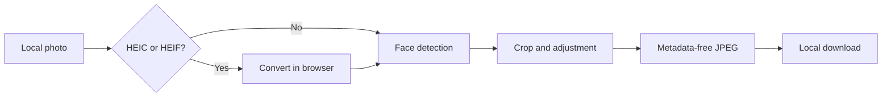

# PhotoSahi

[🚀 Open PhotoSahi](https://mantoshkumar1.github.io/photosahi/)

Prepare ID photos for Canadian and Indian applications in seconds.
Built for Indians living in Canada.

PhotoSahi assists with output dimensions, framing, and file size. Final acceptance is determined by the receiving authority.

---

## Presets available

- Indian PCC
- Canada Citizenship Application / Passport
- Indian Passport Surrender
- Indian OCI Card
- Indian Passport (Reissue)
- LinkedIn
- Microsoft Teams


---

## Features

- Preset output dimensions and framing guidance
- Adjustable face zoom and vertical position
- Target file-size adjustment
- One-click download
- JPEG, PNG, HEIC, and HEIF input
- Local browser processing; selected photos are not uploaded
- Downloaded JPEGs do not retain source location or camera metadata
- Optional text-only feedback form; photos are never attached

## How your photo is processed



The selected photo, converted image, face-detection result, canvas, and downloaded JPEG stay in the browser. The feedback form sends only the category, message, and optional email entered by the user.

See [docs/architecture.md](docs/architecture.md) for the implementation boundary and evidence.

## Supported formats and limitations

- Inputs: JPEG, PNG, HEIC, and HEIF supported by the browser and bundled converter.
- Output: JPEG using the dimensions configured for the selected preset.
- HEIC/HEIF conversion depends on browser memory and the source file; unusually large or damaged files may fail.
- Face detection works best with a front-facing face, the full head visible, and both eyes clear.
- Automated checks cannot validate every lighting, background, expression, recency, printing, or authority-specific requirement.
- A positive quality summary means only that the checks available in PhotoSahi found no actionable issue. It is not an acceptance guarantee.

---

## How to use

1. Open the app
2. Select your application type, e.g; **Indian PCC**
3. Upload your photo
4. Adjust zoom or vertical position if needed
5. Review the preview and quality guidance
6. Download the prepared JPEG

---
## Run locally

```sh
cd photosahi
python3 -m http.server 8080
```

Open `http://localhost:8080`. Press `Ctrl+C` to stop the server.

## Regression tests

```sh
npm test
```

The dependency-free Node test suite covers model readiness, front-facing and downward-looking detection outcomes, no-face guidance, HEIC success and failure, rapid selections, unavailable Debug/Compare behavior, and Blob-based JPEG sizing. Detection responses are mocked so tests remain deterministic and do not require committing personal photos.

Note: If port 8080 is busy, use 8000 or 3000 instead.

---

## Scope

PhotoSahi is an assistive preparation tool, not an issuing authority or professional photo studio. Always review the current instructions from the organization receiving the photo.
