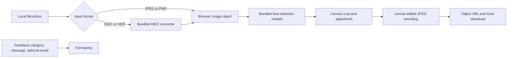

# Local-only photo pipeline

PhotoSahi keeps image processing inside the browser. The only network submission initiated by the application is the optional feedback form, which contains user-entered text fields and never includes the selected photo or canvas.

## Privacy boundary

- Source photos are opened with browser object URLs.
- HEIC/HEIF conversion runs through the bundled converter.
- Face models and model weights are served with the application and execute locally.
- Cropping, rotation, preview, and encoding use browser canvases.
- JPEG output is created with `canvas.toBlob()`, then downloaded through a temporary object URL.
- Re-encoding the rendered canvas creates a new JPEG without copying source EXIF, location, or camera metadata.
- The feedback form contains no file input and constructs its request only from its explicit text fields.

## Evidence and limits

- `npm test` exercises the reliability-critical workflow with deterministic mocks and synthetic Blob data.
- The tests verify application behavior around model readiness and edge cases; they do not measure the accuracy of the bundled face-detection model.
- PhotoSahi provides preparation assistance. Receiving authorities make final acceptance decisions and may apply requirements the application cannot inspect.
